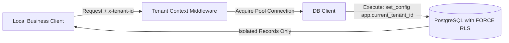

# 🛡️ Multi-Tenant SaaS Architecture & Code Review Deliverable

> Reference implementation & independent technical due diligence deliverables for multi-tenant local service SaaS platforms.

---

## 📌 Repository Overview

This repository demonstrates the assessment methodology and architectural standards required for an **Independent SaaS Architecture & Code Reviewer** role:

1. **[Full Audit Report (PDF/Markdown)](./docs/AUDIT_REPORT.md):** Complete evaluation covering Critical to Advisory risk categorization, business impact analysis, and Keep/Rebuild/Replace recommendations.
2. **Production-Ready Kernel (`src/`):** A working TypeScript + Express + PostgreSQL proof-of-concept demonstrating bulletproof **Row-Level Security (RLS)** and safe tenant-context middleware.

---

## 🏛️ Tenant Isolation Architecture

